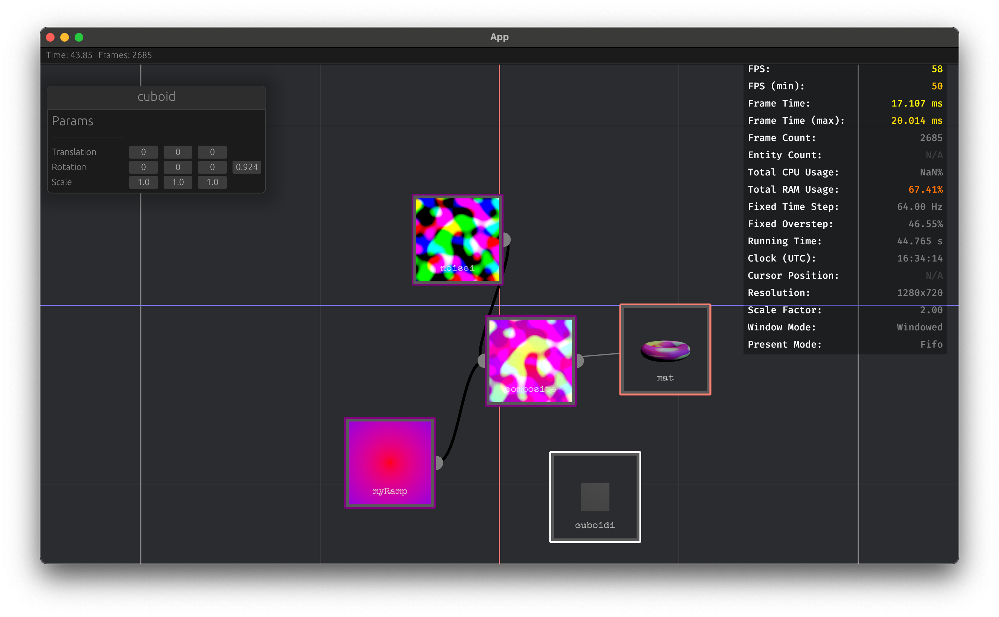

# Sepiascraped

An experimental code-first creative coding environment for [Bevy](https://github.com/bevyengine/bevy).

The idea here is to mix the benefits of node based visual programming with both scripting and Rust:
1. Visual programming is great for quick iteration, as well as being able to see the effects of building up a 
   graph of nodes that operate on each other. In other words, visual programming is best when it's used for defining
   data flow in the application, as well as setting constant parameters or quickly testing out a change.
2. Scripting should be used for the bulk of programmatic logic. While many applications allow scripts to be attached to
   nodes via the UI, scripting should be first class, meaning that we define the graph in scripts. Updates in scripts
   always take precedence over updates in the ui. Currently scripts are written in [Steel](https://github.com/mattwparas/steel),
   a scheme dialect. 
3. The *Rust* codebase that defines the engine should be open and extensible. Users can add new types of behavior directly
  without having to deal with loading plugins, etc. They compile their final application for distribution.

